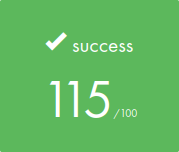

# Libft42

Objetivo deste projeto é codificar uma biblioteca C reagrupando funções usuais que poderemos usar em todos os outros projetos em 42

Objective of this project is to code a C library regrouping usual functions that we will be able to use in all other projects in 42<br/>

A maior parte está na biblioteca C (veja man).  Outros não estão na biblioteca C, mas será muito útil ainda mais.  Estas funções estão descritas no assunto.

The most part is in C library (see man). Others are'nt in the C library but it will be so usefull further. This functions are described in subject.<br/>

## Badge


## SKills

 - Imperative programming
 - Rigor
 - Algorithms & AI

 ## My grade

  

🚧 project:<br/>
```
Libft42 $ make
```
:shower: Clean Obj files:<br/>
```
Libft42 $ make clean
```
:shower: :shower: Clean All (obj files + binary):<br/>
```
Libft42 $ make fclean
```
:shower: :shower: 🚧 Clean All + build:<br/>
```
Libft42 $ make re
```

<br/>See Makefile<br/>

Made with: Jorge Alves, 
           Alfredo Neto https://github.com/Alfredo-Neto
           Alexandre Zamarion https://github.com/alezamarion! <br />
See my LinkedIn:https://www.linkedin.com/in/jorge-eduardo-alves-094b4331/
